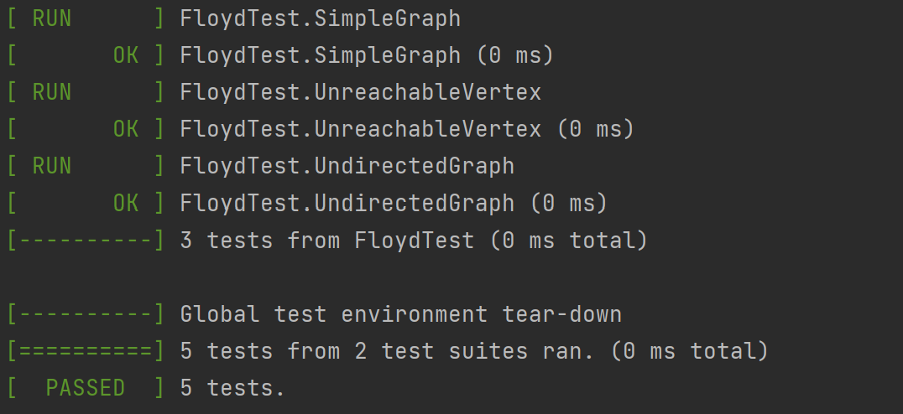

# Лабораторная работа №5
**Алгоритм Флойда–Уоршелла на графах, заданных матрицей смежности**

**Вариант:** Матрица смежности (1), Флойд‑Уоршелл (1)  
**Студент:** Чеботарь Иван Сергеевич  
**Группа:** М8О-105БВ-25  

## 1. Цель работы
Разработать программу на языке C для представления графа матрицей смежности и реализации алгоритма Флойда‑Уоршелла для нахождения кратчайших путей между всеми вершинами. Реализовать CLI, unit‑тесты (Google Test) и бенчмаркинг (Google Benchmark). Сделать загрузку графа из файла и сохранение результатов выполнения на диск

## 2. Реализация
### Для представления графа используется структура GraphMatrix, содержащая его размерность и указатель на матрицу весов
```C
#define INF (INT_MAX / 2)  // представление отсутствия ребра

typedef struct {
    int size;     
    int** matrix;    
} GraphMatrix;
```
- Элемент matrix[i][j] хранит вес ребра из вершины i в j. Если ребра нет, то значение равно INF.
- Диагональные элементы matrix[i][i] всегда равны 0 (расстояние из i в i это 0)
### Для работы с этим представлением в `src/graph.c` реализованы функции:
- `init_gm`, `free_gm` для инициализации и освбождения памяти.
- `add_edge`, `remove_edge`, `get_edge` для работы с весами узлов и их проверки (для соблюдения инварианта (отсутствие петель, INF при отсутствии пути))
### Алгоритм Флойда–Уоршелла (`src/fl_wrsh.c`)
Реализует поиск кратчайших расстояний между всеми вершинами. Его сложность O(n³). Представлен функцией `floyd_warshall`. Так же реализованно освобождение памяти
### Работа с файлами
- Формат ввода: первая строка – количество вершин n, затем n строк по n целых чисел. При числе > INF в матрицу записывается INF. За ввод отвечает (`load_graph_from_file` из `src/graph.c`)
- За сохранение результата в файл, и, опционально, введенных данных, используются (`save_graph_to_file` и `save_result_to_file` (`src/graph.c src/fl_wrsh.c`))
## 3. CLI и работа с файлами
В `main.c` реализован разбор аргументов командной строки. Поддерживаются флаги:
```
--input <file> – обязательный, кроме режима --benchmark и --test (дефолт input.txt)

--output <file> – файл для результата (дефоль result.txt).

--save-graph <file> – сохранить загруженный граф (дефолт result.txt) 

--benchmark – запустить бенчмарк.

--test - запустить unit-тесты

--dont-clear – не затирает файл в который записывает данные при применении флага

--help – справка.
```
## 4. Тестирование
Для тестирования используется Google Test, написаны 5 unit-тестов:
- GraphTest.InitGraph – проверка создания графа.
- GraphTest.AddAndGetEdge – добавление и получение ребра.
- FloydTest.SimpleGraph – граф из 3 вершин с известными путями.
- FloydTest.UnreachableVertex – вершины, между которыми нет пути (проверка INF).
- FloydTest.UndirectedGraph – симметричная матрица, путь через промежуточную вершину.

## 5. Бенчмаркинг
Проведен бенчмарк на случайных данных с увеличением размерности матрицы смежности
```json
Running ../build/benchmark_run
Run on (16 X 3193.91 MHz CPU s)
CPU Caches:
  L1 Data 32 KiB (x8)
  L1 Instruction 32 KiB (x8)
  L2 Unified 512 KiB (x8)
  L3 Unified 16384 KiB (x1)
Load Average: 0.00, 0.00, 0.00
---------------------------------------------------------------
Benchmark                     Time             CPU   Iterations
---------------------------------------------------------------
BM_FloydWarshall/4          895 ns          895 ns       772486
BM_FloydWarshall/8         6222 ns         6222 ns       120467
BM_FloydWarshall/16       37297 ns        37295 ns        17470
BM_FloydWarshall/32      308615 ns       308619 ns         2558
BM_FloydWarshall/64     2368837 ns      2368782 ns          300
BM_FloydWarshall/128   18607476 ns     18606198 ns           40
BM_FloydWarshall/256  150280190 ns    150271252 ns            5
BM_FloydWarshall/512 1157324140 ns   1157277167 ns            1
```
Можно заметить, что с удвоеним размерности время увеличивается примерно в 8 раз, что соответствует заявленной сложности алгоритма в O(n³)

## 7. Запуcк
Сборка:
```python
cd GraphSortCLab

mkdir build && cd build

# (тесты и бенчмарк включены по умолчанию)
cmake ..

cmake --build .
```
Запуск (осуществляется из папки `build`):
```python
./program <flags> #работа с флагами описана в разделе CLI
```
